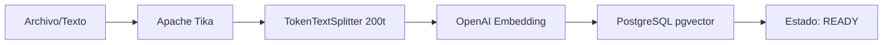
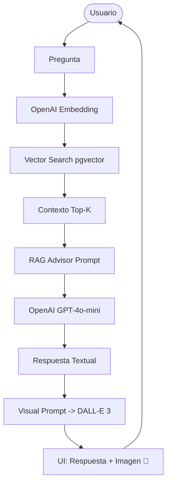

# DocuCanvas 🎨 (Visual RAG Edition)


> **"No leas la documentación, haz que Spring AI te la dibuje"**

DocuCanvas es una plataforma de consulta inteligente sobre documentos que utiliza la potencia de **Spring AI** para no solo responder preguntas basadas en contexto real (RAG), sino también para **generar una representación visual** de ese conocimiento de forma dinámica.

---

## 🛠️ Stack Tecnológico

| Tecnología | Versión | Por qué se usa |
| :--- | :--- | :--- |
| **Java** | 21 | Soporte para Virtual Threads y características modernas del lenguaje. |
| **Spring Boot** | 3.4.4 | Framework base robusto con soporte nativo para IA y observabilidad. |
| **Spring AI** | 1.0.0-M5 | Abstracciones consistentes para modelos de IA sin vendor lock-in. |
| **OpenAI** | Latest | Modelos GPT-4o-mini y DALL-E 3 para razonamiento y visión. |
| **PGVector** | 16 | Extensión de PostgreSQL para búsqueda vectorial nativa con SQL. |
| **Docker** | 25.x+ | Orquestación de servicios e infraestructura persistente. |
| **Apache Tika** | 3.0.0 | Extracción universal de texto de casi cualquier formato (PDF, DOCX). |
| **Alpine.js** | 3.x | Reactividad ligera para la interfaz web. |
| **Plotly.js** | 2.32.0 | Visualización 3D interactiva de los vectores de embedding. |

---

## 🐳 Infraestructura Docker

La aplicación utiliza un entorno pre-configurado mediante **Docker Compose** para garantizar que la base de datos vectorial esté lista sin configuraciones manuales complejas.

### Contenedores en Uso: 1
1. **`docucanvas-db` (ankane/pgvector)**:
   - **Motivo**: Es el corazón del sistema RAG. Provee una instancia de PostgreSQL 16 con la extensión `vector` preinstalada. Esto permite almacenar los embeddings de 1536 dimensiones generados por OpenAI y realizar búsquedas de similitud (distancia de coseno/L2) mediante consultas SQL optimizadas.

---

## 🔌 Diseño de API (Estructura JSON)

Documentación técnica de todos los endpoints disponibles, detallando el contrato de comunicación (Request/Response) en formato JSON.

### 📄 Documentos

#### 1. Listar Documentos
**Endpoint:** `GET /api/v1/documents`

**Request**
*(No requiere cuerpo)*

**Response**
```json
[
  {
    "id": "3fa85f64-5717-4562-b3fc-2c963f66afa6",
    "title": "Manual de Usuario.pdf",
    "sourceType": "PDF",
    "status": "READY",
    "chunkCount": 42,
    "createdAt": "2024-03-27T10:00:00Z",
    "updatedAt": "2024-03-27T10:05:00Z"
  }
]
```

#### 2. Subir Archivo (Binario)
**Endpoint:** `POST /api/v1/documents/upload`

**Request**
*(Form-Data)*
- `file`: (Archivo binario)
- `title`: "Título opcional"

**Response**
```json
{
  "jobId": "a1b2c3d4-e5f6-7890-abcd-1234567890ab",
  "documentId": "a1b2c3d4-e5f6-7890-abcd-1234567890ab",
  "status": "PROCESSING",
  "statusUrl": "/api/v1/ingestion-jobs/a1b2c3d4-e5f6-7890-abcd-1234567890ab"
}
```

#### 3. Importar Texto Directo
**Endpoint:** `POST /api/v1/documents/import-text`

**Request**
```json
{
  "title": "Notas de Reunión",
  "content": "El proyecto DocuCanvas utiliza Spring AI para...",
  "sourceType": "TEXT"
}
```

**Response**
```json
{
  "id": "e9f8g7h6-i5j4-k3l2-m1n0-p9q8r7s6t5u4",
  "title": "Notas de Reunión",
  "status": "READY",
  "createdAt": "2024-03-27T11:20:00Z"
}
```

#### 4. Consultar Estado de Ingesta
**Endpoint:** `GET /api/v1/ingestion-jobs/{id}`

**Request**
*(Path Variable: jobId)*

**Response**
```json
{
  "jobId": "a1b2c3d4-e5f6-7890-abcd-1234567890ab",
  "documentId": "a1b2c3d4-e5f6-7890-abcd-1234567890ab",
  "status": "READY",
  "processedChunks": 15,
  "error": null,
  "createdAt": "2024-03-27T11:00:00Z",
  "finishedAt": "2024-03-27T11:02:00Z"
}
```

### 🧠 Consultas IA

#### 5. Pregunta RAG Multimodal
**Endpoint:** `POST /api/v1/questions/ask`

**Request**
```json
{
  "question": "¿Qué es DocuCanvas?",
  "maxChunks": 5,
  "documentId": "3fa85f64-5717-4562-b3fc-2c963f66afa6"
}
```

**Response**
```json
{
  "question": "¿Qué es DocuCanvas?",
  "answer": "DocuCanvas es una plataforma de consulta inteligente...",
  "sources": ["Manual de Usuario.pdf"],
  "chunkCount": 3,
  "imageUrl": "https://oaidalleapiprodscus.blob.core.windows.net/..."
}
```

### 📊 Visualización (VectorStore)

#### 6. Obtener Chunks (Mapa 3D)
**Endpoint:** `GET /api/v1/chunks/visualize`

**Request**
*(No requiere cuerpo)*

**Response**
```json
[
  {
    "id": "chunk-0b1c",
    "content": "DocuCanvas utiliza embeddings de OpenAI...",
    "coordinates": [-0.1245, 0.4578, -0.8912],
    "documentName": "Arquitectura.pdf"
  }
]
```

#### 7. Chunks por Documento
**Endpoint:** `GET /api/v1/chunks/document/{id}`

**Request**
*(Path Variable: documentId)*

**Response**
```json
[
  {
    "id": "chunk-a7b2",
    "content": "Contenido específico del fragmento...",
    "coordinates": [0.01, -0.05, 0.12],
    "documentName": "Documento_Muestra"
  }
]
```

#### 8. Búsqueda Semántica Pura
**Endpoint:** `GET /api/v1/chunks/search?query=...`

**Request**
*(Query Param: query)*

**Response**
```json
[
  "chunk-uuid-1",
  "chunk-uuid-2",
  "chunk-uuid-3",
  "chunk-uuid-4",
  "chunk-uuid-5"
]
```

---

## 🖼️ Vistas de la Aplicación

A través de la interfaz superior, puedes navegar por los diferentes módulos de la demo:

1.  **Subir (Alimentar el Cerebro)**: Punto de entrada para ingesta de archivos o texto directo.
2.  **Vista Indexación**: Auditoría visual de cómo Spring AI fragmentó un documento específico en chunks.
3.  **Visor de Embeddings**: Mapa interactivo 3D que muestra la ubicación semántica de los fragmentos en el espacio vectorial.
4.  **Pipeline RAG**: Diagrama animado que explica el flujo de datos multimodal en tiempo real.
5.  **Preguntar (Chat)**: Interfaz principal donde ocurre la recuperación semántica y la generación visual con ImageModel.

---

## 🏗️ Arquitectura del Sistema

El proyecto sigue una **Arquitectura Hexagonal (Puertos y Adaptadores)**, asegurando que el dominio esté protegido de dependencias externas.

### Tuberías de Datos (Pipelines)

#### 1. Pipeline de Ingesta e Indexación


#### 2. Pipeline Multimodal (RAG + Visión)


---

## 📂 Estructura de Carpetas

```text
c:/intelijent/Proyecto_Base_SpringBoot/
├── src/main/java/com/docucanvas/
│   ├── api/                        # Adaptadores de Entrada (REST, Dto, Advice)
│   ├── application/                # Servicios Core (Chunk, Ingestion, Question)
│   ├── domain/                     # Lógica de Negocio (Modelos, Repositorios)
│   └── infrastructure/             # Adaptadores de Salida (Config, AI, Persistence)
├── src/main/resources/
│   ├── db/migration/               # Flyway SQL (V1 a V4)
│   ├── static/                     # Frontend (AlpineJS + Plotly)
│   └── application.yaml            # Configuración OpenAI y Postgres
├── docker-compose.yml              # Servidor PGVector
└── pom.xml                         # Dependencias Maven
```

---

## 🔐 Seguridad y Notas de Demo
- **Acceso Directo**: Para esta demostración técnica, la seguridad en `SecurityConfig.java` se ha establecido en `permitAll()` para permitir un acceso fluido.
- **Base de Datos**: PGVector corre en el puerto `5433` (vía Docker) para evitar conflictos con instancias locales de Postgres.

---

## 🚀 Ejecución Rápida
1. `docker-compose up -d`
2. `./mvnw spring-boot:run`
3. Abrir [http://localhost:8080](http://localhost:8080)
