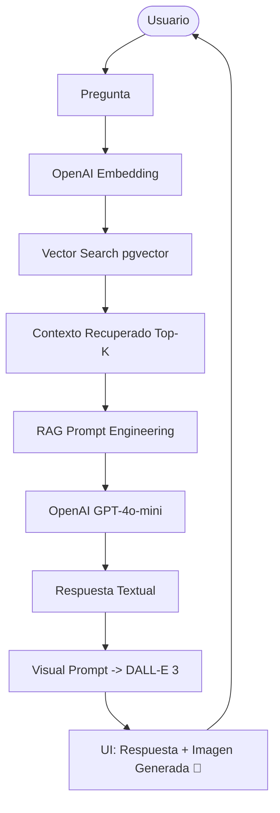

# DocuCanvas 🎨 (Visual RAG Edition)


> **"No leas la documentación, haz que Spring AI te la dibuje"**

DocuCanvas es una plataforma de consulta inteligente sobre documentos que utiliza la potencia de **Spring AI** para no solo responder preguntas basadas en contexto real (RAG), sino también para **generar una representación visual** de ese conocimiento de forma dinámica.

---

## 🎨 Características Principales (Demo-Ready)

A diferencia de los chats tradicionales con PDFs, DocuCanvas implementa un pipeline multimodal completo:

1. **Ingesta y Chunking Optimizado**: Extracción con Tika y fragmentación inteligente a 200 tokens para demostración visual y ahorro masivo de costos de contexto LLM.
2. **Indexación Aislada (Transparencia RAG)**: Nueva vista interactiva que permite auditar cómo el sistema divide la información por cada documento (chunking y vectores 3D).
3. **Recuperación Semántica**: Búsqueda vectorial exacta en PostgreSQL con la extensión PGVector.
4. **Generación de Texto (Grounded)**: Respuestas fundamentadas usando métricas de similitud de coseno para evitar alucinaciones.
5. **Generación Visual Multimodal**: Uso de `ImageModel` (DALL-E 3) para transformar el conocimiento recuperado en una infografía/imagen de alta calidad.

---

## 🚀 Instalación y Uso Rápido

### Requisitos Previos
- Docker Desktop (Para la Base de Datos Vectorial)
- Java 21 + Maven
- API Key de OpenAI

### Pasos para Ejecutar
1. **Levantar Infraestructura**:
   ```bash
   docker-compose up -d
   ```
   *(Esto descargará y ejecutará `pgvector/pgvector:16`, creando una base de datos 100% limpia).*
   
2. **Configurar API Key**:
   Configura tu variable en `src/main/resources/application.yaml` o mediante variable entorno de tu SO:
   ```yaml
   spring.ai.openai.api-key: sk-tu-api-key
   ```
   
3. **Ejecutar Spring Boot**:
   ```bash
   ./mvnw spring-boot:run
   ```
   Al iniciar, Flyway ejecutará automáticamente todas las migraciones SQL (`V1` a `V4`) garantizando que el esquema de PGVector sea el correcto.

4. **Acceder a la Interfaz Web**:
   Ingresa a [http://localhost:8080](http://localhost:8080).
   - ¡Sube un documento!
   - Visita la **Vista Indexación** para visualizar el trabajo fragmentado que hizo Spring AI.
   - Pide al Chat que te genere una respuesta gráfica.

---

## 📂 Arquitectura (Clean Architecture)
```text
c:/intelijent/Proyecto_Base_SpringBoot/
├── src/main/java/com/docucanvas/
│   ├── api/                        # Controladores REST y UI 
│   ├── application/                # Servicios Core (ChunkService, IngestionService, RAG)
│   ├── domain/                     # Modelos y Puertos DB
│   └── infrastructure/             # Configuración Spring AI, Postgres
├── src/main/resources/
│   ├── db/migration/               # Flyway SQL (V1, V2, V3, V4)
│   ├── static/index.html           # Interfaz Gráfica (AlpineJS + Plotly)
│   └── application.yaml            # Configuración
└── docker-compose.yml              # PGVector Server
```

## 📉 Pipelines (Flujos de Proceso)

### Tubería de Ingesta e Indexación


### Tubería Multimodal (RAG + Visión)


## 🔐 Seguridad y Notas de Demo
- **Usuario web**: `user`
- **Contraseña**: Revisa la terminal de Java al iniciar (`Using generated security password...`)
