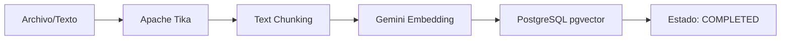
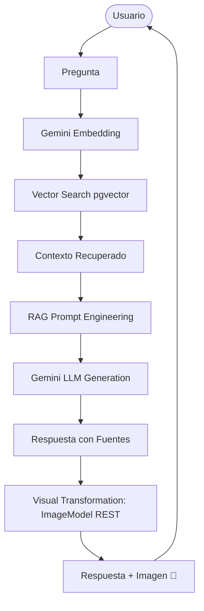

# DocuCanvas 🎨 (Visual RAG Edition)


> **"No leas la documentación, haz que Spring AI te la dibuje"**

DocuCanvas es una plataforma de consulta inteligente sobre documentos que utiliza la potencia de **Spring AI** para no solo responder preguntas basadas en contexto real (RAG), sino también para **generar una representación visual** de ese conocimiento de forma dinámica.

---

## 🎨 Visual RAG: El Pilar de la Charla

A diferencia de los chats tradicionales con PDFs, DocuCanvas implementa un pipeline multimodal completo:

1.  **Ingesta**: Extracción con Tika y Chunking inteligente.
2.  **Recuperación**: Búsqueda semántica en PGVector.
3.  **Generación de Texto**: Respuesta fundamentada (Grounded) para evitar alucinaciones.
4.  **Generación Visual**: Uso de `ImageModel` para transformar el conocimiento recuperado en una imagen descriptiva.

### 🎥 Demo E2E (Script)

Puedes ejecutar la demo completa usando el script de PowerShell incluido:
```powershell
./demo_e2e.ps1
```

---

## 🚀 Instalación y Uso
DocuCanvas es una plataforma avanzada de Análisis de Documentos con Generación Aumentada por Recuperación (RAG).

## 📂 Estructura de Carpetas

El proyecto sigue una arquitectura hexagonal (Clean Architecture):

```text
c:/intelijent/Proyecto_Base_SpringBoot/
├── src/main/java/com/docucanvas/
│   ├── api/                        # Capa de Entrada (Adaptadores de Conducción)
│   │   ├── controller/             # Controladores REST
│   │   └── dto/                    # Objetos de Transferencia de Datos (Req/Res)
│   ├── application/                # Capa de Aplicación (Lógica de Casos de Uso)
│   │   ├── service/                # Servicios de Orquestación (Ingesta, RAG)
│   │   └── usecase/                # Definición de Casos de Uso
│   ├── domain/                     # Capa de Dominio (Núcleo del Negocio)
│   │   ├── model/                  # Entidades y Objetos de Valor
│   │   └── repository/             # Interfaces de Repositorio (Puertos)
│   └── infrastructure/             # Capa de Infraestructura (Adaptadores de Salida)
│       ├── ai/                     # Clientes de IA (Gemini REST)
│       ├── persistence/            # Implementaciones de Base de Datos (JPA/JDBC)
│       └── config/                 # Configuraciones de Framework
├── src/main/resources/
│   ├── db/migration/               # Scripts de Flyway (Esquema SQL)
│   ├── static/                     # Frontend (HTML, JS, CSS)
│   └── application.yaml            # Configuración del entorno
├── docker-compose.yml              # Infraestructura (PostgreSQL + pgvector)
└── pom.xml                         # Gestión de dependencias Maven
```

## 🛠️ Stack Tecnológico

| Componente | Tecnología | Versión |
| :--- | :--- | :--- |
| **Lenguaje** | Java | 21 |
| **Framework** | Spring Boot | 3.4 |
| **Base de Datos** | PostgreSQL (pgvector) | latest |
| **IA (LLM)** | Google Gemini (Pro/Flash) | 1.5 |
| **Embeddings** | Google AI (text-embedding) | 004 |
| **Persistencia** | Spring Data JPA / JDBC | 3.4 |
| **Migraciones** | Flyway | 10.x |
| **UI Styling** | Tailwind CSS | 3.x |

## 🔌 Diseño de la API REST

**URL Base**: `http://localhost:8080/api/v1`

| Recurso | Método | Endpoint | Descripción |
| :--- | :--- | :--- | :--- |
| **Documentos** | GET | `/documents` | Listar todos los documentos indexados |
| **Importación** | POST | `/documents/import-text` | Ingesta de texto plano directa |
| **Upload** | POST | `/documents/upload` | Carga de archivos (PDF, MD, TXT) |
| **Jobs** | GET | `/ingestion-jobs/{id}` | Estado del proceso de ingesta |
| **Preguntas** | POST | `/questions/ask` | Consulta RAG sobre los documentos |

### Detalles de Request/Response

#### 1. Ingesta de Texto (`/documents/import-text`)
- **Request (JSON)**:
  ```json
  {
    "title": "Título del doc",
    "content": "Contenido extenso...",
    "sourceType": "TEXT"
  }
  ```
- **Response (JSON)**: Objeto `Document` con ID y estado `PENDING`.

#### 2. Carga de Archivos (`/documents/upload`)
- **Request (Multipart)**: Campo `file` (binario), `title` (string).
- **Response (JSON)**:
  ```json
  {
    "jobId": "uuid",
    "status": "ACCEPTED",
    "trackingUrl": "/api/v1/ingestion-jobs/..."
  }
  ```

#### 3. Consulta RAG (`/questions/ask`)
- **Request (JSON)**:
  ```json
  {
    "question": "¿Qué dice el documento sobre X?",
    "maxChunks": 5
  }
  ```
- **Response (JSON)**:
  ```json
  {
    "question": "repregunta",
    "answer": "Respuesta generada por Gemini...",
    "sources": ["doc_id_1", "doc_id_2"],
    "chunksAnalyzed": 5,
    "imageUrl": "data:image/png;base64,..."
  }
  ```

## 🔍 Monitoreo y Documentación Interactiva

- **Swagger UI**: [http://localhost:8080/swagger-ui/index.html](http://localhost:8080/swagger-ui/index.html) (Para probar los endpoints visualmente).
- **Health Check**: [http://localhost:8080/actuator/health](http://localhost:8080/actuator/health) (Estado de la app y DB).
- **API Docs**: [http://localhost:8080/v3/api-docs](http://localhost:8080/v3/api-docs) (Esquema OpenAPI).

## 🔐 Seguridad (Modo Demo)

Por defecto, la aplicación incluye **Spring Security**. Para facilitar la demo:
- **Usuario**: `user`
- **Contraseña**: Se genera aleatoriamente en la consola al iniciar (busca: `Using generated security password`).
- **Nota**: Se recomienda añadir un `WebSecurityCustomizer` para liberar los recursos estáticos si la UI se bloquea.


## 📉 Pipelines (Flujos de Proceso)

### Tubería de Ingesta e Indexación


### Tubería de Consulta RAG + Visual (MULTIMODAL)


## 🚀 Pasos para Ejecutar

1. **Levantar DB**: `docker-compose up -d`
2. **Configurar API Key**: Añadir `spring.ai.google.ai.gemini.api-key` en `application.yaml`.
3. **Compilar y Ejecutar**: `./mvnw spring-boot:run -Dmaven.test.skip=true`
4. **Acceder**: `http://localhost:8080`
