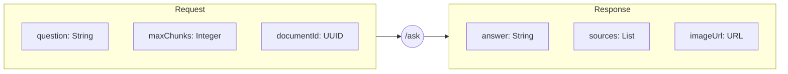
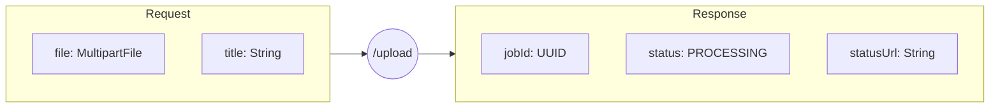
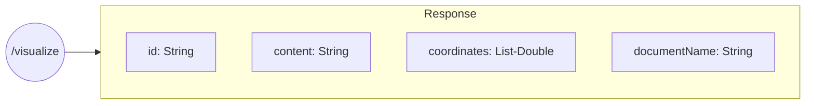
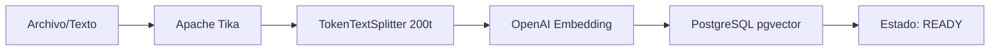

# DocuCanvas 🎨 (Visual RAG Edition)


> **"No leas la documentación, haz que Spring AI te la dibuje"**

DocuCanvas es una plataforma de consulta inteligente sobre documentos que utiliza la potencia de **Spring AI** para no solo responder preguntas basadas en contexto real (RAG), sino también para **generar una representación visual** de ese conocimiento de forma dinámica.

---

## 🛠️ Stack Tecnológico

| Tecnología | Versión | Por qué se usa |
| :--- | :--- | :--- |
| **Java** | 21 | Soporte para Virtual Threads y características modernas del lenguaje. |
| **Spring Boot** | 3.4.4 | Framework base robusto con soporte nativo para IA y observabilidad. |
| **Spring AI** | 1.0.0-M5 | Abstracciones consistentes para modelos de IA sin vendor lock-in. |
| **OpenAI** | Latest | Modelos GPT-4o-mini y DALL-E 3 para razonamiento y visión. |
| **PGVector** | 16 | Extensión de PostgreSQL para búsqueda vectorial nativa con SQL. |
| **Docker** | 25.x+ | Orquestación de servicios e infraestructura persistente. |
| **Apache Tika** | 3.0.0 | Extracción universal de texto de casi cualquier formato (PDF, DOCX). |
| **Alpine.js** | 3.x | Reactividad ligera para la interfaz web. |
| **Plotly.js** | 2.32.0 | Visualización 3D interactiva de los vectores de embedding. |

---

## 🐳 Infraestructura Docker

La aplicación utiliza un entorno pre-configurado mediante **Docker Compose** para garantizar que la base de datos vectorial esté lista sin configuraciones manuales complejas.

### Contenedores en Uso: 1
1. **`docucanvas-db` (ankane/pgvector)**:
   - **Motivo**: Es el corazón del sistema RAG. Provee una instancia de PostgreSQL 16 con la extensión `vector` preinstalada. Esto permite almacenar los embeddings de 1536 dimensiones generados por OpenAI y realizar búsquedas de similitud (distancia de coseno/L2) mediante consultas SQL optimizadas.

---

## 🔌 Diseño de API (Visual)

A continuación se detalla la estructura de los endpoints principales mediante diagramas de flujo de datos (Request ➔ Response).

### 1. Consulta RAG Multimodal
**Endpoint:** `POST /api/v1/questions/ask`



### 2. Ingesta de Documentos (Upload)
**Endpoint:** `POST /api/v1/documents/upload`



### 3. Visualización de Espacio Latente
**Endpoint:** `GET /api/v1/chunks/visualize`



---

## 🖼️ Vistas de la Aplicación

A través de la interfaz superior, puedes navegar por los diferentes módulos de la demo:

1.  **Subir (Alimentar el Cerebro)**: Punto de entrada para ingesta de archivos o texto directo.
2.  **Vista Indexación**: Auditoría visual de cómo Spring AI fragmentó un documento específico en chunks.
3.  **Visor de Embeddings**: Mapa interactivo 3D que muestra la ubicación semántica de los fragmentos en el espacio vectorial.
4.  **Pipeline RAG**: Diagrama animado que explica el flujo de datos multimodal en tiempo real.
5.  **Preguntar (Chat)**: Interfaz principal donde ocurre la recuperación semántica y la generación visual con ImageModel.

---

## 🏗️ Arquitectura del Sistema

El proyecto sigue una **Arquitectura Hexagonal (Puertos y Adaptadores)**, asegurando que el dominio esté protegido de dependencias externas.

### Tuberías de Datos (Pipelines)

#### 1. Pipeline de Ingesta e Indexación


#### 2. Pipeline Multimodal (RAG + Visión)


---

## 📂 Estructura de Carpetas

```text
c:/intelijent/Proyecto_Base_SpringBoot/
├── src/main/java/com/docucanvas/
│   ├── api/                        # Adaptadores de Entrada (REST, Dto, Advice)
│   ├── application/                # Servicios Core (Chunk, Ingestion, Question)
│   ├── domain/                     # Lógica de Negocio (Modelos, Repositorios)
│   └── infrastructure/             # Adaptadores de Salida (Config, AI, Persistence)
├── src/main/resources/
│   ├── db/migration/               # Flyway SQL (V1 a V4)
│   ├── static/                     # Frontend (AlpineJS + Plotly)
│   └── application.yaml            # Configuración OpenAI y Postgres
├── docker-compose.yml              # Servidor PGVector
└── pom.xml                         # Dependencias Maven
```

---

## 🔌 Endpoints de la API (v1)

### Documentos
- `GET /api/v1/documents`: Lista todos los documentos y su estado.
- `POST /api/v1/documents/upload`: Sube un archivo binario.
- `POST /api/v1/documents/import-text`: Importa texto plano directamente.
- `GET /api/v1/ingestion-jobs/{id}`: Consulta el estado tras una carga.

### Consultas IA
- `POST /api/v1/questions/ask`: Envía una pregunta al pipeline RAG.
  - **Request**: `{ "question": "...", "maxChunks": 5, "documentId": "..." }`
  - **Response**: `{ "question": "...", "answer": "...", "sources": [...], "imageUrl": "..." }`

### Visualización
- `GET /api/v1/chunks/visualize`: Obtiene todos los chunks con coordenadas 3D.
- `GET /api/v1/chunks/document/{id}`: Obtiene los chunks de un documento específico.
- `GET /api/v1/chunks/search?query=...`: Similitud semántica pura de chunks.

---

## 🔐 Seguridad y Notas de Demo
- **Acceso Directo**: Para esta demostración técnica, la seguridad en `SecurityConfig.java` se ha establecido en `permitAll()` para permitir un acceso fluido.
- **Base de Datos**: PGVector corre en el puerto `5433` (vía Docker) para evitar conflictos con instancias locales de Postgres.

---

## 🚀 Ejecución Rápida
1. `docker-compose up -d`
2. `./mvnw spring-boot:run`
3. Abrir [http://localhost:8080](http://localhost:8080)
